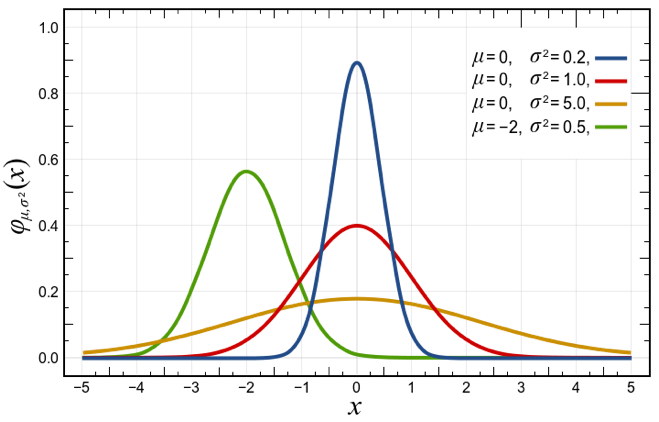

# Basic Usage

Here we would like to show you some basic structures
including paragraphs, links, lists, verbatims (usually for code blocks),
tables, figures, footnotes, index, and bibliography.
If you want to force to make a newline, you can add an empty line or use the command `\newline`.
If you want to force to start a whole new page, you can use the command `\clearpage` before your new content.

## Paragraph \label{start-paragraph}

The following is a paragraph.

Lorem ipsum dolor sit amet, consectetur adipiscing elit.
Duis ullamcorper neque sit amet lectus facilisis sed luctus nisl iaculis.

If you use a `\label{start-paragraph}` in the section/chapter title, then you could use a

`\ref{start-paragraph}` to refer to this section/chapter.
For example, please refer to \ref{start-paragraph}.

## Link

Here is a link => [A link to Google](https://www.google.com)

## List

The following is a list.

* The 1st main item
    - A sub item 1 of the 1st main item
    - A sub item 2 of the 1st main item
* The 2nd main item
    - A sub item 1 of the 2nd main item
    - A sub item 2 of the 2nd main item
* The 3rd main item
    - A sub item 1 of the 3rd main item
    - A sub item 2 of the 3rd main item

## Verbatim

The following is a verbatim which is usually to show a code block (use `python` as an example).

```
print 'Hello World!'

for i in [ 'Hello', 'World!' ]:
  print i

if True:
  print 'Hello World!'
else:
  print 'Stay at home.'
```

\clearpage

## Table

### Standard Markdown Table
A standard markdown table supports single line only in each column and its width can not be modified.
This table can also be rendered well on common markdown platforms (ex: [GitHub](https://github.com/)).

 Right | Left | Default | Center 
------:|:-----|---------|:------:
   12  |  12  |    12   |    12  
  123  |  123 |   123   |   123  
    1  |    1 |     1   |     1  

Table: A Standard Markdown Table \label{sm-table}

If you use a `\label{sm-table}` in the table caption, then you could use a

`\ref{sm-table}` to refer to this table.
For example, please refer to Table. \ref{sm-table}.

### Extended Markdown Table
An extended markdown table supports multiple lines in each column.
This table can **not** be rendered well on common markdown platforms (ex: [GitHub](https://github.com/)).

----------------------------
 Centered  Default     Right
  Header   Aligned   Aligned
---------- -------- --------
   First   row,         12.0
           long
           content

  Second   row           5.0 
----------------------------

Table: An Extended Markdown Table \label{em-table}

If you use a `\label{em-table}` in the table caption, then you could use a

`\ref{em-table}` to refer to this table.
For example, please refer to Table. \ref{em-table}.

### How to Make an Extended Markdown Table Wider?
For an extended markdown table, you can also modify its width by adding more hyphens "\-".

--------------------------------------------------------------------
 Centered            Default                                   Right
  Header             Aligned                                 Aligned
-------------------- ------------------------------- ---------------
   First             row,                                       12.0
                     long content,
                     long content,
                     long content,
                     long content,
                     long content,
                     long content,
                     long content,
                     long content,
                     long content,
                     long content

  Second             row                                         5.0
--------------------------------------------------------------------

Table: A Wider Extended Markdown Table \label{wem-table}

If you use a `\label{wem-table}` in the table caption, then you could use a

`\ref{wem-table}` to refer to this table.
For example, please refer to Table. \ref{wem-table}.

\clearpage

## Figure

The following is a figure.



If you use a `\label{fig:normal-distribution}` in the figure caption, then you could use a

`\ref{fig:normal-distribution}` to refer to this figure.
For example, please refer to Fig. \ref{fig:normal-distribution}.

## Footnote

In a paragraph, sometimes you need to make a further (but short) explanation for some keywords.
You could use footnotes to do this. The following are 2 footnotes examples.

The normal distribution is found by Carl Friedrich Gauss[^gauss].

The student's t distribution is found by William Sealy Gosset[^gosset].

[^gauss]: Carl Friedrich Gauss (30 April 1777 – 23 February 1855) was a German mathematician and physicist.

[^gosset]: William Sealy Gosset (13 June 1876 – 16 October 1937) was an English statistician.

## Assign index for keyworkds

You can assign index for keyworks by using `Keywords\index{Keywords}`.
The following are 2 examples.

The normal distribution is found by Carl Friedrich Gauss\index{Carl Friedrich Gauss}.

The student's t distribution is found by William Sealy Gosset\index{William Sealy Gosset}.

You can go to "Index" part in the last page to check if indexes are generated.

## Cite from bibliography/references

You have to define bibliography in the `yaml` header of the `md` first and then you can use `\cite` to refer to it.
The following is a paragraph with 3 items cited.

This paragraph is an example of **`thebibliography`** environment using
in bibliography management. Three items are cited: *The \LaTeX Companion*
book \cite{latexcompanion}, the Einstein journal paper \cite{einstein}, and the
Donald Knuth's website \cite{knuthwebsite}. The \LaTeX related items are
\cite{latexcompanion,knuthwebsite}.

\clearpage


